# AutoNova Company Brain — Entity Relationship Diagram (ERD)

## Architectural Overview
The Company Brain database layer is structured across 5 distinct operational layers in **PostgreSQL 17 + pgvector**:
1. **Layer A — Organisation & Project Master**: Core business domains, departments, cost centers, personnel, projects, budgets, platforms, and services.
2. **Layer B — Source-Specific Typed Tables**: Normalized schema representations of 7 enterprise systems (LeanIX, Confluence, SharePoint, GitHub, Jira Cloud, Microsoft Teams, ServiceNow).
3. **Layer C — Semantic Graph**: Unified knowledge graph nodes (`entity`) and directed edges (`relationship`), synchronized via `rebuild_graph()`.
4. **Layer D — Knowledge, Evidence & Vectors**: Raw immutable source payloads (`source_item`), unified documents (`document`), and chunked text (`document_chunk`) with `tsvector` and `vector(1536)` HNSW indexes.
5. **Layer E — Engine Support & Governance**: Operational readiness scorecards, conflict detection rules, sync watermarks, and planted anomaly registries.

---

## 5-Layer Mermaid Diagram

```mermaid
erDiagram
    %% Layer A: Master
    DEPARTMENT ||--o{ COST_CENTER : assigns
    DEPARTMENT ||--o{ PERSON : employs
    DOMAIN ||--o{ PROJECT : categorizes
    COST_CENTER ||--o{ PROJECT_BUDGET : funds
    PERSON ||--o{ TEAM_MEMBER : belongs_to
    TEAM ||--o{ TEAM_MEMBER : contains
    PROJECT ||--o{ PROJECT_BUDGET : has
    PROJECT ||--o{ PROJECT_COST_BREAKDOWN : details
    PROJECT ||--o{ PROJECT_PERSON : allocates
    PERSON ||--o{ PROJECT_PERSON : assigned
    PROJECT ||--o{ PROJECT_DEPENDENCY : consumes
    PROJECT ||--o{ PROJECT_DEPENDENCY : provides
    PLATFORM ||--o{ PLATFORM_SERVICE : offers
    PLATFORM_SERVICE ||--o{ PROJECT_SERVICE_USAGE : used_by
    PROJECT ||--o{ PROJECT_SERVICE_USAGE : uses
    INITIATIVE ||--o{ PROJECT_INITIATIVE : groups
    PROJECT ||--o{ PROJECT_INITIATIVE : participates

    %% Layer B: Typed Sources
    PROJECT ||--o{ LX_APPLICATION : represents
    LX_APPLICATION ||--o{ LX_APP_CAPABILITY : maps
    LX_APPLICATION ||--o{ LX_INTERFACE : exposes
    LX_APPLICATION ||--o{ LX_APP_ITCOMPONENT : utilizes
    PROJECT ||--o{ CF_SPACE : documents
    CF_SPACE ||--o{ CF_PAGE : contains
    CF_PAGE ||--o{ ADR : decides
    PROJECT ||--o{ SP_SITE : archives
    SP_SITE ||--o{ SP_DOCUMENT : stores
    PROJECT ||--o{ GH_REPO : codebases
    GH_REPO ||--o{ GH_COMMIT : tracks
    GH_REPO ||--o{ GH_PULL_REQUEST : reviews
    GH_REPO ||--o{ GH_RELEASE : tags
    PROJECT ||--o{ JIRA_PROJECT : manages
    JIRA_PROJECT ||--o{ JIRA_ISSUE : tracks
    PROJECT ||--o{ TM_CHANNEL : communicates
    TM_CHANNEL ||--o{ TM_MEETING : hosts
    TM_MEETING ||--o{ TM_DECISION : records
    PROJECT ||--o{ SN_CI : registers
    SN_CI ||--o{ SN_INCIDENT : suffers
    SN_CI ||--o{ SN_CHANGE : modifies
    SN_CI ||--o{ SN_OPERATIONAL_READINESS : monitors

    %% Layer C: Semantic Graph
    ENTITY ||--o{ RELATIONSHIP : source
    ENTITY ||--o{ RELATIONSHIP : target

    %% Layer D: Knowledge & Evidence
    SOURCE_ITEM ||--o{ DOCUMENT : normalizes
    DOCUMENT ||--o{ DOCUMENT_CHUNK : splits
```

---

## Key Cross-Layer Relationship Chains
- **Service Outage Propagation**: `platform_service` $\rightarrow$ `service_dependency` $\rightarrow$ `project_service_usage` $\rightarrow$ `project` $\rightarrow$ `project_dependency` (Downstream dependent projects).
- **Project Master RACI**: `project` $\rightarrow$ `project_person` $\rightarrow$ `person` $\rightarrow$ `team` $\rightarrow$ `domain`.
- **Evidence Provenance**: `document_chunk` $\rightarrow$ `document` $\rightarrow$ `source_item` $\rightarrow$ Raw JSON payload.
